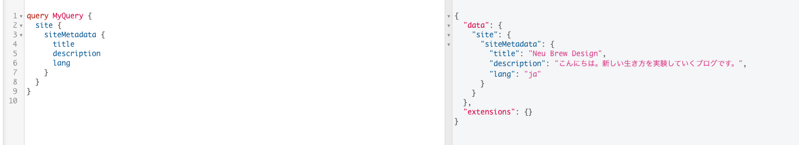

いまのままではこのブログのtitleにURLがむきだしになっているため、メタデータを設定します。

まずは必要なプラグインをインストールします。

```
yarn add gatsby-olugin-react-helmet- react-helmet
```

gatsby-config.jsにも忘れずに記載します。

まずサイト全体で使用するメタデータの値を用意します。

```javascript
module.exports = {
  siteMetadata: {
    title: "ブログタイトル",
    description: "ブログの概要",
    lang: "ja",
  },
```

そしてクエリを作成します。



こんな感じ。

src/components/以下にseo.jsを作成して、クエリを追加します。

```javascript
import React from "react"
import { Helmet } from "react-helmet"
import { useStaticQuery, graphql } from "gatsby"

const Seo = () => {
  const data = useStaticQuery(graphql`
  query {
    site {
      siteMetadata {
        title
        description
        lang
      }
    }
  }
`)

  return (
    <Helmet>
      <html lang={data.site.siteMetadata.lang} />
      <title>{data.site.siteMetadata.title}</title>
      <meta name="description" content={data.site.siteMetadata.description} />
    </Helmet>
  )

}

export default Seo
```

これで基本の設定は完了です。


#### ページごとにメタデータの値を変える

つづいては、他のページのタイトルと説明をpropsで置き換えられるようにします。

```
const Seo = props => { ... }
```

`()`をpropsに置き換えます。

各ページでタイトルや説明に指定が入っている場合、値を置き換えるようにします。

```javascript
  const title = props.pagetitle
    ? `${props.pagetitle} | ${data.site.siteMetadata.title}`
    : data.site.siteMetadata.title
  const desc = props.pagedesc || data.site.siteMetadata.description
  
  return (...)
```

こんな感じです。

これを応用して、URLを明示させましょう。seo.jsに以下を追加します。

```javascript
  const url = props.pagepath
    ? `${data.site.siteMetadata.siteUrl}${props.pagepath}`
    : data.site.siteMetadata.siteUrl
    
    return (...)
```

そして404ページに`location`を追加し、ページのパスを指定します。

```javascript
const NotFoundPage = ({ location }) => { 
  return (
    <Layout>
      <Seo pagetitle="ページが見つかりません"
        pagepath={location.pathname} />
```

これでひとまずメタデータの設定は完了です。


#### OGPを追加する

普通のWebサイト同様、OGPの設定を書いていきます。

```javascript
  const url = props.pagepath
    ? `${data.site.siteMetadata.siteUrl}${props.pagepath}`
    : data.site.siteMetadata.siteUrl

  const imgurl = props.pageimg
    ? `${data.site.siteMetadata.siteUrl}${props.pageimg}`
    : `${data.site.siteMetadata.siteUrl}/ogimage.jpg`

  const imgw = props.pageimgw || 1200
  const imgh = props.pageimgh || 600
```

URLやOGイメージ画像の設定は上記のとおりです。

```javascript
  return (
    <Helmet>
      {/* ogp */}
      <meta property="og:site_name" content={data.site.siteMetadata.title} />
      <meta property="og:title" content={title} />
      <meta property="og:description" content={desc} />
      <meta property="og:url" content={url} />
      <meta property="og:type" content="website" />
      {/* ogp image */}
      <meta property="og:image" content={imgurl} />
      <meta property="og:image:width" content={imgw} />
      <meta property="og:image:height" content={imgh} />
      <meta name="twitter:card" content="summary_large_image" />
    </Helmet>
  )
```

設定は以上です。
