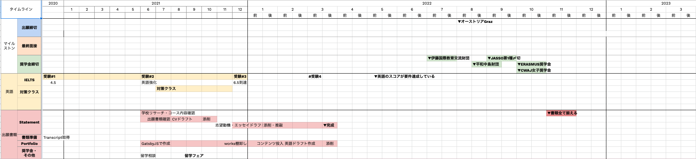

2020年から漠然と留学、大学院留学について考えていたけど今年から本腰入れて準備していこうと思う。これはその決意表明のような記事です。

海外に行く、海外で暮らす、海外の大学で学ぶことは以前から憧れていた。たぶん大学生になってフロリダに行ってからだと思う。それまでには一度、高校の修学旅行でニュージランドへ行ったくらい。

フロリダに行く前から親の勧めでプロテスタント系の教会が行なっている英会話教室に通っていた。週一回ほどだったのであまり上達するほどではなかったがそこでのアメリカ出身の先生たちとの会話は面白かったので楽しく続けることができた。

英会話に通っているうちに徐々に独学で英語学習を始めた。学生のうちに海外に行きたくなったのだ。目的地はハリーポッターを生んだ国、イギリス。ただしロンドンは生活費がかかる上にハリポタの中で出てきたのはキングスクロス駅くらいだ。実際の舞台になったスコットランドにあるグラスゴー美術学校に決めた。その学校にはインタラクションデザインコースという当時の大学の学部と関連するコースがあった。

1年か2年の春休みから英語の勉強を始め、TOEFL受験を目指した。ちなみにこの前に受験したTOEICのテストではほぼ勉強せずに300点台を叩き出した。そして交換留学で必要な英語スコアも出願可能なギリギリの400点台でイギリスへ渡ってしまった。しかもろくに留学準備もしていなかったので、英語も費用もぼろぼろであった。

学生の頃の失敗と反省を活かし、社会人となった今は準備と貯金も含めて留学の計画を立てている。憧れのままで終わらせたくないのだ。なので、大学院留学を検討している。

ひとまず今の自分はどれほど出願要件を満たしているのか考えてみる。

### 自分の現在地から出願までのステップ

**①専攻を選ぶ**

UXデザインについて体系的かつ実践的に学びたいのと、認知科学について興味があるのでインタラクションデザインコースに決めている。

**②大学院をリサーチ、出願候補校（暫定校）を決める**

現在の自分が志望する学校は以下の5校。いずれも上記のコースがあり、サイトなどを見て自分が学んでみたいことと合致していそう。

- Estonia Academy of Arts 🇪🇪
- Tallin University 🇪🇪
- SUPSI 🇨🇭
- MASTER OF SCIENCE IN DIGITAL DESIGN AND INTERACTIVE TECHNOLOGIES 🇩🇰
- FH JOANNEUM UNIVERSITY OF APPLIED SCIENCES 🇦🇹

最初は盲目的にエストニアに行きたい！と考えていたけど、いろいろ調べていくうちに北欧もいいなと思ったり、やっぱりスウェーデンは高いなと思ったり、スイスやオーストリアの学校も良いぞとなったりしたけど、自分が学びたい内容と学費の面を考慮した結果、この5校となった。

これはまだ暫定で、サイトみる限りは良いなーと思ってるけど実際の授業の様子や学校を見てみないと確定できないと思っていて、今の状況では無理だけど渡航ができれば学校見学に行きたいなと考えてる。

**④試験対策スケジュールを立てる**

今年の初めから文法や単語のやり直しと英会話に通い始めてみて、英語学習を習慣化した。2020年7月末に最初のIELTSテストを受け、その時の結果から考えて、今現在の私の英語力では応募要件の足切りにしかならないレベル。奨学金ももらいたいので、7.0を目指すとすると、結構英語を強化しないといけない。2021年の上半期で中級レベルの英語力になってきてはいると思うのだけど、スピーキングとライティングのスキルを向上する必要がある。

2021年6月に2度目の受験をしたので、この結果でもう一度対策クラスに通うか検討する。たぶん通うと思う。そして2ヶ月〜4ヶ月間クラスに通って、今年の12月に3度目の受験をする。ここで6.5に到達したい

**⑤出願校を決める**

2021年の9月までに決めたい

**⑥出願要件を確認する**

出願する学校について、学費、日本円換算、出願期間、デッドライン、応募要件、エッセイテーマ、国などリサーチしたものをスプレッドシートにまとめてチャートにしています。
ここで出願に必要な書類やスコアを都度確認しつつ、時々Webサイトもみて〆切がいつなのかを確認している。

おおまかなタイムラインはスプレッドシートで作っている。

**⑦出願書類を用意する**

出願にするのに必要なもの。

- 学士の成績証明書
- 学士の卒業証明書
- パスポートのID
- 英語力スコア（足切りは各パートが5.5が最低限のスコア）
- CV
- エッセイ（志望理由だったり、テーマがあったりする）
- ポートフォリオ
  - 修士と関連する内容だったり、10以上のプロジェクトが必要だったりする

今用意できるのは、成績証明書、卒業証明書、パスポートくらい。英語スコアは来年までとして、あとはCVが作成できるかな？
一番の課題は、ポートフォリオ制作だな。これは今のうちから準備しておきたい。

**⑧出願・合否確認**

ここは後々、記事にしていきます。

今後、なにか事が進行したら逐一記事にして進捗を書いていきたいと思います。
