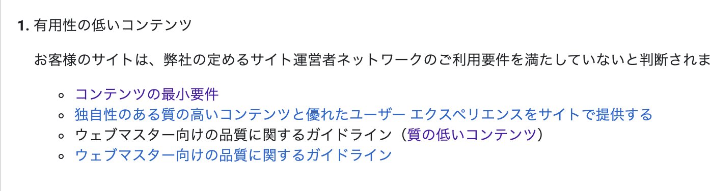

前回の記事で10記事以上書いたら、アドセンスを申請すると書きましたが、プロフィールとお問い合わせページを含めると10記事に到達していた時点で申請しました。

https://www.neubrewdesign.com/blog-report-1year

6月16日に申請を申し込み、30日に審査不合格のメールがきました。だいたい2週間くらいでしょうか。

昨今はアドセンス審査も厳しくなってると聞くので、やはりまだ記事数が足りていないことも要因のひとつかもしれません。

Googleによると不合格の原因は以下の4つです。

コンテンツの最小要件とあるので、やはり記事数が足りなさそうですね。この記事を含めて現在で13記事ほどです。次は20記事以上書いてから申請してみます。

過去記事を見返していたら、今年の12月までにアドセンスで実際に振り込みができる最低金額である八千円の収益を目標にしていた。それなのに、7月はほぼ更新がないという…

このままでいかんので、今週から来週までの約2週間はがんばって毎日更新していきます。そして少しずつブログ機能を整備していきます。

GatsbyJSもどんどんアップデートしていくので、習慣的にコード書いていかないとすぐ忘れてしまう。

今年の末にはドメイン代を払えるくらいにはブログひとつで稼げるようにがんばります。