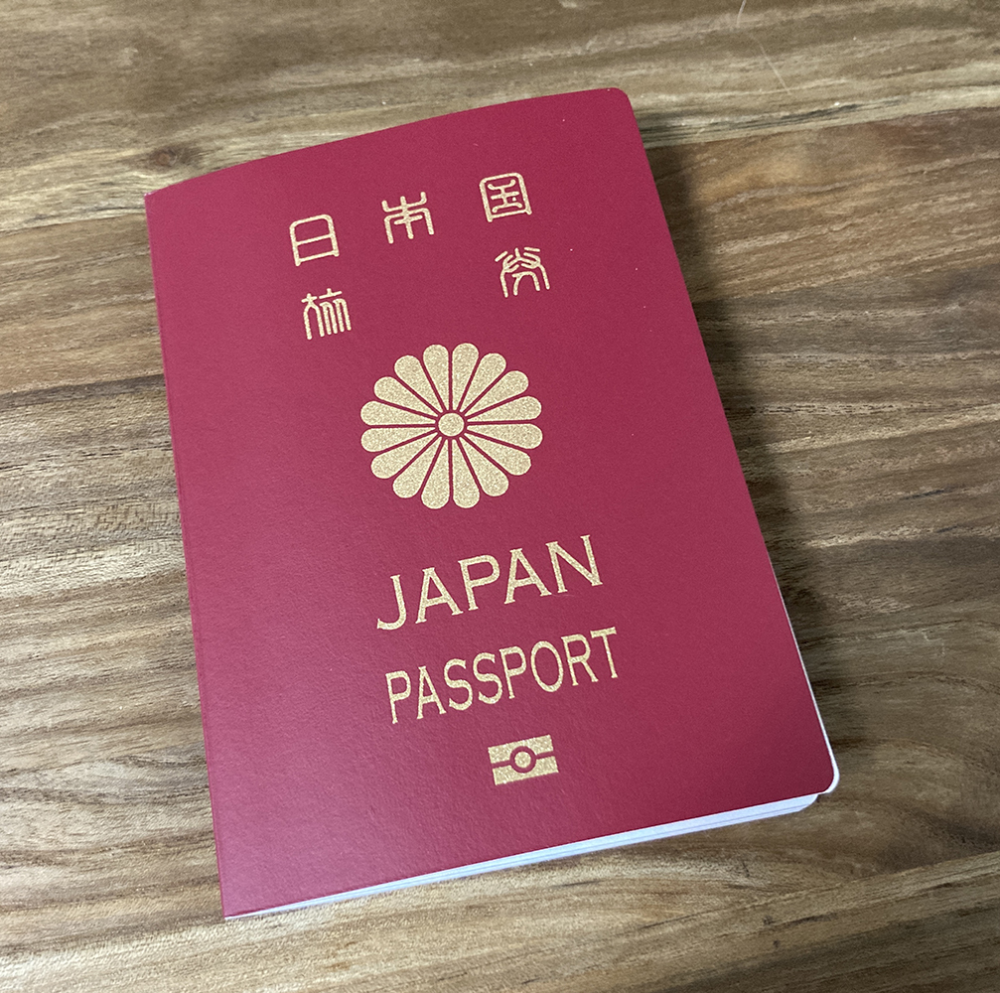
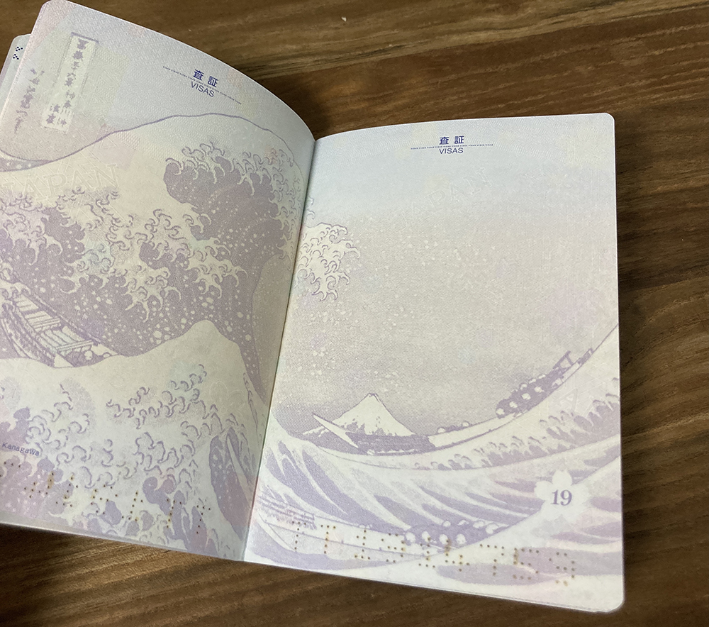

今年の7月15日付で持っているパスポートの期限が切れてしまいました。しばらくはこの状況下で海外旅行に行くことはできませんが、IELTSという英語の試験を受験するにはパスポートが必要です。そのために、新しいパスポートが必要でした。
今まで使用していたパスポートは、5年版でちょうど5年前の交換留学へ行く前に発行したものです。あれから5年も経ったのかと思うと感慨深い。そしてあれから5年後の今も、また留学したいという思いを携えて、準備中です。

みんなが旅行に行かないこのタイミングだからこそ、窓口も空いているのでいまが一番いいタイミングかもしれません。

### パスポート申請に必要なもの

今回は10年用のパスポートを申請してきました。申請用の紙は市役所や旅券事務所においてあります。用意するのは申請書と戸籍謄本か戸籍抄本、住民票の写し、そしてパスポート用の写真です。

このうち戸籍謄本と住民票の写しはコンビニで取得できます。1枚のコピーで400円です。また住民基本台帳ネットに登録されていれば住民票の写しもなくて問題ありません。申請する際に、窓口で住基ネットでお願いしますと伝えれば、400円分が浮きます。

10年用だと収入印紙用に1万6千円ほど費用がかかりますが、それはパスポートを受け取る時でも問題ないので、申請するだけなら手ぶらでいけます。

今回は神戸にある旅券事務所ではなく、尼崎出張所へ申請してきました。もし写真を忘れたり、パスポート用として使用できなくても、旅券事務所の中や、阪急塚口駅周辺にも証明写真機があります。履歴書用の写真だとサイズがひとまわり小さいので、パスポート用写真を選択しましょう。旅券事務所の案内の人に従って撮影する方が一番いいです。

パスポートの受け取りまでにかかる期間は約1週間ほどです。運転免許を持っていないので、身分を証明するものがマイナンバーカードとパスポートしかないんですよね。

受け取ってから気づいたのですが、新パスポートはデザインが葛飾北斎の「冨嶽三十六景」に変更されていました。VISAページが全て富士山が描かれていてかっこいいです。以前のデザインは数字のみでしたが、新しい方は偽造防止の面で北斎デザインに採用されたようです。
5年用は16作品、10年用は24作品がデザインに採用されています。

それぞれのデザインはこちら。
https://www.mofa.go.jp/mofaj/files/000432933.pdf

ひとまずこれで次のIELTS試験が受けられるのと、渡航までのタスクを1つ完了しました。
