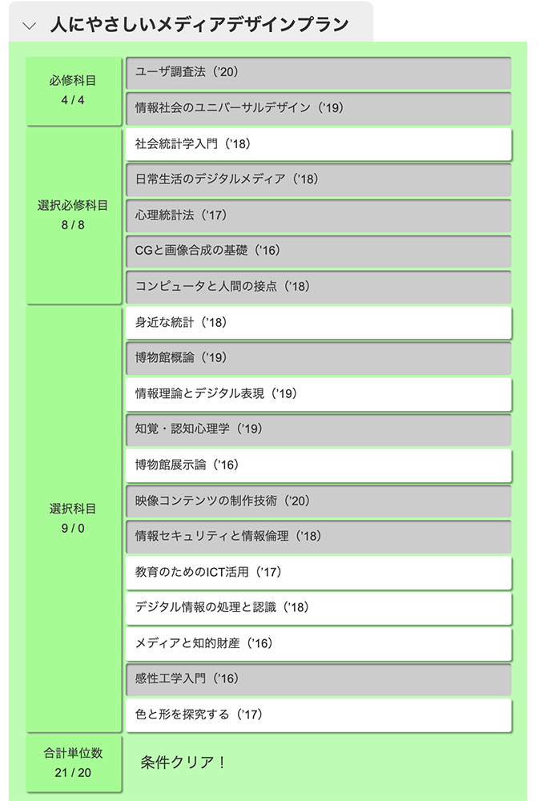
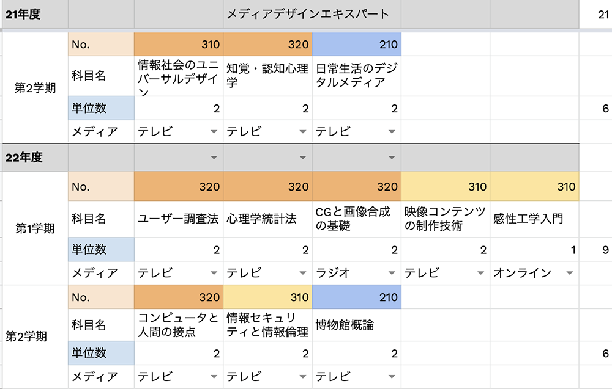

2021年度第2学期の選科履修生として出願しました。合格できれば10月から3年ぶり2回目の大学生をやります。
出願した理由は、心理学や認知科学について学びたい思いと情報についての知識を体系的に学びアップデートしようと考えたからです。またこの学びが今後行く予定の海外大学院留学のよい下積みになればと思います。

昨年くらいから心理学について勉強したいな〜と漠然と考え、いろいろ一般の大学のオープンキャンパスとか大学院について調べていたのですが、通学が難しいのと学費が高いので二の足を踏んでいました。

さらに調べていくなかで放送大学も候補に上がっていましたが昨年は調べるだけで終わっており、今年の夏にようやく資料を請求して、科目をみてから出願を決意しました。

なぜ心理学を学びたいのかというと、最初に働いた会社で体調と精神を崩したことで、自分の弱さ・生きづらさと向き合ったからです。また海外の大学に留学するも夢を諦められず、サービスデザインをやる上では心理学・情報学やメディアについての知識も絡んでくるので海外へいく前に日本の大学で学んでおこうと考えました。

学部案内の資料をみたら、放送大学の仕組みや科目の取り方についてまとまっているので、ネットで検索するより分かりやすいです。また募集要項をよく読んでみたら、[科目群履修認証制度「放送大学エキスパート」](https://www.ouj.ac.jp/hp/gakubu/expert/)というものがあり、なんと「人にやさしいメディアデザイン」というプランがある！しかも、これは2021年3月末で廃止するらしい。
これは、情報と心理学を学ぶにはちょうどよいプランとなり得る。しかも履修するべき科目が予め決まっているのでなにをとるか迷うことがない。

そういうわけで、選科履修生としてメディアデザイン科目を学びます。

#### 費用と学生の種類

放送大学の費用は、出願する学生の種類によって異なります。私はすでに四年制大学を卒業して学士号を持っており、特定の科目だけ学びたかったので、選科履修生を選びました。

| 学生種   | 入学金 | 授業料                    |
| -------- | ------ | ------------------------- |
| 全科履修 | 24,000 | 1単位 5,500, 2単位 11,000 |
| 選科履修 | 9,000  |                           |
| 科目履修 | 7,000  |                           |

それぞれの学生区分の入学金＋選択した科目の授業料×科目数で納入する費用になります。私の場合は、9000円×3科目なので4万2000円を入学時に支払うことになります。
5万円以下で大学生の身分になれて、勉強ができるのでお得です！

#### 出願方法について

資料を取り寄せてすぐ入学しようと決断したので第1回の出願期間に間に合いました。初めて出願するので少し戸惑いましたが、出願するにあたって大事なことはどの学生種で入学するか、および受講する科目を予め決めておくことです。なので、最低1科目は受講する科目の科目No.を控えておくとよいです。

まず学生の種類を選びます。二重で出願することはできません。お試しなら科目生が一番安いですが、専科履修生は、2000円違うだけで1年学生になれるので、選科履修生の方がよいかもしれません。

学生種を選んだら、学生情報について入力していきます。メールアドレスを入れたタイミングでこのアドレス宛にメールを送信します。と表示されますが、登録完了してから少し経って入力したメールアドレスに出願完了メールが届きます。

この時、時間をおきすぎるとタイムアウトされて再度入力し直しとなるので、ささっと済ませてしまいましょう。また出願時点で科目登録を行うので、とりたい授業を予め決めておきましょう。登録画面でもシラバスで確認できます。

登録完了しても、出願期間中であれば科目を選び直すことができます。登録後の画面で、かから費用が表示されます。

#### 履修予定科目と気になる授業

資料を取りよせて、シラバスの授業科目案内見てたらわくわくしてきました。学部時代も科目群みてどの授業選択しよう？と計画するのが一番の楽しみでした。さて、放送大学でエキスパートプランの人にやさしいメディアデザインの科目をみてみます。
[人にやさしいメディアデザイン](https://www.ouj.ac.jp/hp/gakubu/expert/assets/pdf/expert_2021_guide.pdf)

2つ、必須科目がありほとんどは情報コースの授業が多いです。その次に心理コースと社会コースの統計学なんかもあります。美大のときにはなかった授業ばかりで少しわくわくします。

全部20単位以上取れば良いのですが、なにを取ればいいのかわからなくなったので、こちらの判定ツールを利用しました。
[判定ツール](https://javascriptplayground.web.fc2.com/utilities/ouj-experts/)

上記の通り履修していこうと思います。知覚・認知心理学、ユーザー調査法、感性工学入門などUIデザインに関するものばかりで受講するのが楽しみです。

このエキスパートプランは、科目生や選科履修生でもプランに沿って履修することができるのですが、単位をすべて取得したのち、認証を申請しようと思ったら全科履修生になる必要があります。

なので、この1年は選科履修生として学び、それ以降は全科履修生として継続入学しようと考えています。他にも学びたい科目あるし、いい機会です。たぶん全科生として情報コースに入学するつもりです。Webやサービスデザインやるなら一番適している科目。

いまはエキスパートプランの科目を優先的に取得するつもりでいますが、他にもとりたい科目がいっぱい迷っちゃう。語学や他の専門科目を履修するかも。
これからなにを履修していくかは考え中ですが、今の段階で履修計画を立ててみました。

1学期に取れる科目は5個が限度かな。

放送大学に出願するにあたって、いろいろな方のブログを参考にしました。

今後も大学での学びについて書いていこうと思います。

参考にしたブログ：
- [放送大学関連記事](https://sasorizano.hatenablog.com/archive/category/放送大学)
- [放送大学生のブログ](https://streptococcus.hatenablog.com/archive/category/放送大学関連)
- [情報コースに入学した方の記事](https://travel-times.hatenablog.com/entry/ouj1)
