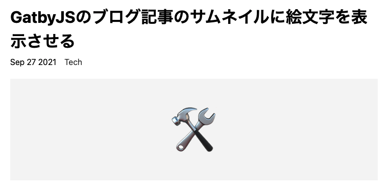

これまで画像をつくっていたサムネイルを絵文字を表示させて統一感を出すことにしました。
今までは記事に合ったサムネイル画像をcanvaなので作って記事ごとに表示させていました。そうすると、いちいち画像を作らないといけない、画像がないときはブログのog画像が代わりに表示されて少し地味になるなど手間がかかると思い始めました。

最近だと、zenn.devを始め、わざわざアイキャッチ画像を設定せず、記事の内容やカテゴリーに合った絵文字を表示させている媒体をよく見かけます。

  
見た目はこんな感じ。

### やったこと
絵文字を表示させるために[react-emoji-render](https://github.com/tommoor/react-emoji-render)を使用しました。

```
yarn add react-emoji-render
```

絵文字を表示させたいページもしくはコンポーネントに読み込みます。
```
import Emoji from "react-emoji-render"
```

markdownで書いている記事に、`emoji: "🛠"`を追加し、graphqlクエリにも`emoji`を追記します。
そして表示させたいところに1行追加します。
```
<figure>
  <Emoji text={node.frontmatter.emoji || "📝"} />
</figure>
```
emojiがnullの場合は固定の絵文字を表示させるようにしています。

### 絵文字を中央寄せにする

ちなみに、絵文字を左右中央寄せにする場合は、`<Emoji />`の親要素に対して`display: flex`を設定して、`justify-content`, `align-items`にそれぞれ`center`とします。
```
figure {
  display: flex;
  justify-content: center;
  align-items: center;
}
```

また絵文字はTwitterで使われているようなフラットなものにも変換できます。
その場合は、Twemojiを読み込みます。
```
import { Twemoji } from 'react-emoji-render';
...
<Twemoji svg text={emoji || "💻"} />
```

今後も記事執筆の面倒さを少しずつ改善していきます。

参考にした記事はこちら
- https://catnose99.com/blazing-fast-writing/
- https://gdhg.info/posts/gatsby-blog-emoji-thumbnail/
- https://k-log.netlify.app/blog/gatsby-blog-emoji-thumbnail

