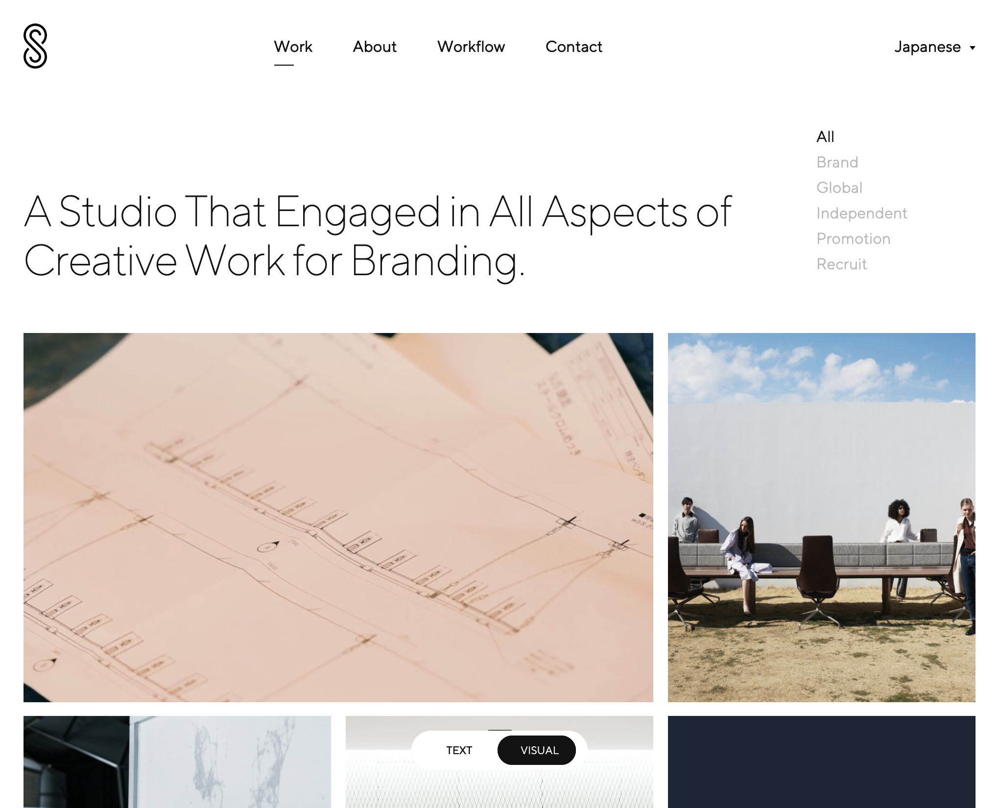

### 参考にしたいデザイナーのポートフォリオサイト

こんにちは。[Haruka](https://twitter.com/neubrewdesign)です。

2021年も半分を過ぎましたね。就活や転職活動中の方は一度じぶんの仕事や実績を棚卸しして、そろそろポートフォリオサイトを新しく作ろうかと考えているのではないでしょうか。もしくはデザインや使用している技術を見直して作り直そうと思われている人もいるかもしれませんね。

かくいう私もそうです。じぶんの名前で独自ドメインを取り、GatsbyJSを使ってみた土台を作ってみたはいいものの、肝心の中身がまだできていない状態です。これではドメイン代を払う意味がありませんので、この機会にリニューアルしようと考えています。

そこで、どんなポートフォリオサイトにすればいいのか、みなさんの参考になりそうなサイトを集めてみました。Web制作会社と個人の方を掲載しています。

#### HIROKA HASEGAWA

[http://hirokahasegawa.com/](http://hirokahasegawa.com/)

デザイナー・長谷川弘佳さんのポートフォリオサイト。
トップではビジュアルを大きく見せていますが、projectページでは長方形のフォルムで並べて一覧性を出していますね。各プロジェクトの右側にトンボのようなガイドマークが粋な演出です。
説明文はフォントサイズが12pxと小さめですが、文章量が多いためかもしれません。

#### SHIANBROWN

[https://badbadnotgood.design/](https://badbadnotgood.design/)

Shimura Tetsuroさんの個人のポートフォリオサイト。日本デザインセンターのオンスクリーン室の方です。

背景の色を自由に変えられるカスタム性とWebサイトの画面を実機のiPadに映して見せているのが独特ですね。フォントはNoto Serifで全体的に明朝体が主役です。

#### Yuya Kinoshita

[https://yuyakinoshita.com/](https://yuyakinoshita.com/)

デザイナー・フロントエンドエンジニアの木下裕哉さんのポートフォリオ兼ブログです。作ったものとデザインやコーディングに対しての知見を一緒に見られるとどういう考えでデザイン・実装しているのかが人となりが分かってよいですね。

またこの方はaboutページでしっかりと、プロフィール・専門分野・経歴と書かれているのでスキルや経験が分かるように見せています。個人でサイトから仕事をもらうにはこちらが大変参考になりますね。

#### 三浦和紀

[https://kazunorimiura.com/](https://kazunorimiura.com/)

UX/UIデザイナーの三浦和紀さんのポートフォリオサイト。こちらの方はいくつか素敵なTumblrテーマを制作されているのでご存知の方もいるのではないでしょうか。

トップで大きく一つのプロジェクトを見せて、スクロールして下にプロジェクトの概要や解説が閲覧できる見せ方ですね。またこの方もプロフィールにおいて、個人の事業でなにをやるのか、どう提案できるのかが明確に記載されているので依頼する側にはとても分かりやすいですね。

#### SHIFTBRAIN

[https://shiftbrain.com/](https://shiftbrain.com/)

web制作会社・シフトブレインのサイトです。ビジュアルを大きく見せてシンプルな構成です。

Workflowで制作進行の流れやどれくらいの期間かかるのかが説明されているので、依頼する側も問い合わせ内容を考えやすくなりそうですね。

[https://standard.shiftbrain.com/](https://standard.shiftbrain.com/)

こちらは厳密にはポートフォリオではありませんが、トップのテキストからケースステディ、チームの紹介へと一直線に見せている構成がポートフォリオの構成の参考になりそうです。

#### Terminal

[https://www.terminaldesign.jp/](https://www.terminaldesign.jp/)

デザイン会社のサイトです。個人的にはSPでの見た目が好きです。またプロジェクトイメージに映像を使うのもありですね。ただ全体的にフォントサイズが14pxと小さく文章が読みづらいかもしれません。

以上で、6個のポートフォリオをご紹介しました。他にも参考になりそうなサイトを見つけたら随時追加していこうと思います。

いずれのサイトも、

- トップではビジュアルを大きく見せる
- タイポグラフィや色使いはシンプルに
- aboutページで自分の経歴・スキル・何ができるかについて説明する

が共通項になっています。

またプロジェクトの下層ページでは、クレジット表記はもちろんですが、そのサイトやデザインについての概要、解説やフィロソフィーなどテキストでも魅せることができます。

自分のサイトに掲載するworksについて考えたら、次は上記を参考にして構成を考えていくといいかもしれません。
