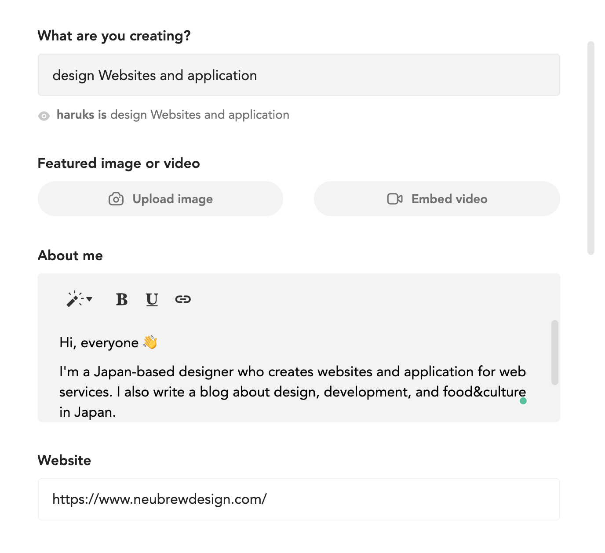

こんにちは。[Haruka](https://twitter.com/neubrewdesign)です。

最近は投げ銭や寄付する形のサポート機能が増えてきましたね。noteやpixiv Fanboxがいい例ですが、ひとつのサービスに固有する機能とは別に個人のサイト・ブログでも使用できるサービスもいろいろあります。

今回はこのブログにもサポート機能を置いてみようと思い、どんなものがあるのか調べてみました。
特に個人ブログで設置できて、使ってみたいと思うサービスは以下の4つです。
- buy me a coffee
- codoc
- ofuse
- paypal.me

codoc（コードク）とofuseは日本発のサービスですね。buy me a coffeeはその名の通りコーヒー一杯を送ることができます。paypal.meもありますが、今回はbuy me a coffeeでPayPalアカウントを使用するのでここはおいておきます。

この中からコーヒー1杯の価格で支援するBuy me a coffeeを選びました。さっそくこのブログにも設定してみます。

#### Buy me a coffeeの使い方

まずはアカウントを作りましょう。

[Buy me a coffee](https://www.buymeacoffee.com/)

アカウントを作る際に、サポートを受けるクリエイターか支援する側か選びます。サポートを受けたいならクリエイターを選択しましょう。
次に自分のURLを作るための名前を決めます。ここで決めた名前でURLが生成されます。

https://www.buymeacoffee.com/haruks

こんな感じ。ただしこの時点では自分のURLへアクセスしても404ページとなっています。


#### 決済方法を決める

URLを決めたら、次は自分の国とどの通過で受け取るかを選びます。現在はまだ英語圏とユーロでしか受け取れないようです。日本人が使用していると運営会社に伝わるとJPNも追加されるでしょうか。そして受け取りたい決済サービスを選択します。ここではPaypalかStripeのいずれかを選べます。Razorpayというサービスもあるみたいですがまだできないみたいですね。

Stripeアカウント持ってないし、Paypalも以前に解約してしまいましたが、今回はPaypalを使うことにします。先にPaypalで新しくアカウントを使ってからEnableボタンをクリックして、Paypalアカウントと紐づけてみます。

コネクトした先で個人で使うかビジネスで使用するか聞かれますのでどちらか選択します。うまくいけば登録したメールアドレス宛にThanks for connecting to Publisherr Incというタイトルでメールが届いているはずです。

届いていれば登録完了です🎉


#### プロフィールを埋める

ダッシュボードにアクセスできれば自分のプロフィールを埋めてみましょう。サポートする人たちからあなたが何をしている人なのかがわかります。



プロフィールを書く場所は主に3つあります。

1. What are you creating?
   1. ここは自分が何をしている／作っている人なのかを記入しましょう
2. About me
   1. ここには簡単な自己紹介を書きます。Twitterのプロフィールに書いていることと同じで良いです。海外の割合が多いので少しは英語で書いたほうがいいのかもしれません。他のユーザーも見られるので書き方を真似するのもありですね。
3. Website
   1. 自分のブログやサイトのURLを記入します。


次に、自分がサポートを受けるものを選択します。デフォルトでコーヒー☕️、ビール🍺、ピザ🍕、本📖の4つがありますが、絵文字の中から好きなものをなんでも選ぶことができます。例えばおにぎり🍙とかね。

私はドーナツ🍩にしてみました。ドーナツ大好きなので。サポートされた金額でミスド行きたい。

プロフィールを完了するとこのようにシェアできます！

<blockquote class="twitter-tweet"><p lang="ja" dir="ltr">komazawa (<a href="https://twitter.com/neubrewdesign?ref_src=twsrc%5Etfw">@neubrewdesign</a>) is design Websites and application 🎉<br><br>You can support by buying a doughnut 🍩 here — <br><br>ドーナツ1つからサポートできるようになりました！<a href="https://t.co/A6rdVSv70b">https://t.co/A6rdVSv70b</a></p>&mdash; komazawa (@neubrewdesign) <a href="https://twitter.com/neubrewdesign/status/1404764786366181382?ref_src=twsrc%5Etfw">June 15, 2021</a></blockquote>


#### 記事にボタンを埋め込む

サポート機能のウィジェット部分を埋め込むには、ダッシュボードにあるIntegrations to take it to the next levelからWebサイトボタンを作ります。

色やフォントをカスタムできるので自分のサイトに合ったボタンを生成しましょう。
これをブログや記事下に設置すれば終わりです。WordPressやはてなブログなら普通に記事に生成されたリンクを貼り付けるだけでリンクが生成されますが、、GatsbyJSで作られたブログで貼る方法についてご紹介します。

やり方は簡単で、ダッシュボードで生成したウィジェットのコードをmarkdownの中ではなく、`gatsby-ssr.js`というファイルを作り、その中に記述します。

```
const React = require("react")

exports.onRenderBody = ({ setPostBodyComponents }) => {
  setPostBodyComponents([
     // ここにウィジェットのコードを貼り付ける
    <script
      data-name="BMC-Widget"
      data-cfasync="false"
      src="https://cdnjs.buymeacoffee.com/1.0.0/widget.prod.min.js"
      data-id="haruks"
      data-description="Support me on Buy me a coffee!"
      data-message="Thank you for visiting. You can buy me a donut."
      data-color="#FFDD00"
      data-position="Right"
      data-x_margin="64"
      data-y_margin="72">
    </script>,
  ]);
};
```
上記のように記述したあと、restartして立ち上げ直すと、サイトの下の方にウィジェットが表示されます。`data-x_margin`と`data-y_margin`の値で位置を調整できるのでちょうどよい場所に設定してあげましょう。なお、値を変更したときは再度立ち上げる必要があります。

`templates/blog-post.js`に以下のようにリンクを設置すれば全ての記事の下に設置されます。
```
<a href="https://www.buymeacoffee.com/haruks">
   
</a>
```

この記事の一番下にも表示されています。これで記事を読んでくれた人たちからサポートされる準備が整いました。
もしこの記事がお役に立っていればぜひウィジェットからサポートしてみてください。